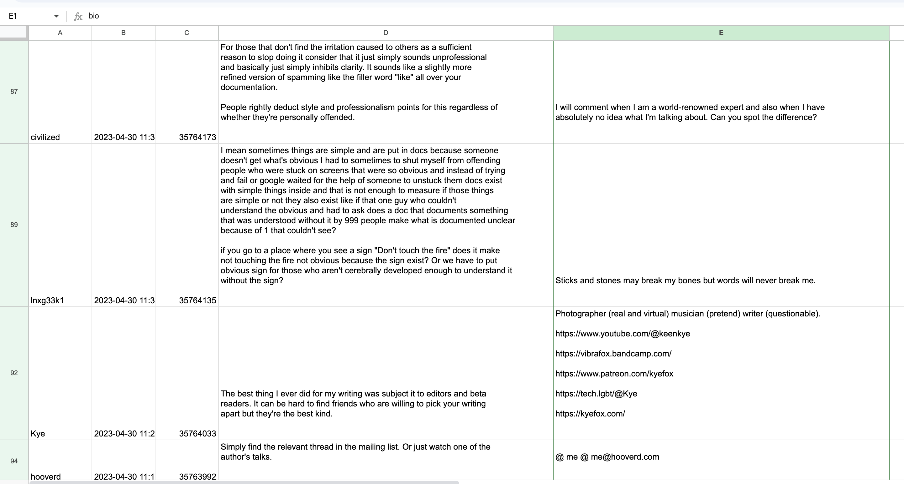

# Hacker News Comment Bios

This is a tool for getting leads from [HackerNews](https://news.ycombinator.com/) threads.
Often you want to reach
out to people that have participated in a conversation. With this tool you get
a csv of an entire thread along with the About info for the commentor.
Because HN bios do not have an email field, users usually put their
email in the about section.

## Running

Written for python 3.11 and pipenv.

`pipenv install`

Determine the thread id. it is the last number in the url `https://news.ycombinator.com/item?id=35759449`

Replace the story id in the variable `STORY_ID` in the source code `get_comments.py`.

`python get_comments.py`

You'll have a `hacker_news_comments.csv` file created locally.

## Other resources

1. Inspired by https://github.com/jaredsohn/hacker-news-download-all-comments
1. algolia api https://hn.algolia.com/api
1. official hn api https://github.com/HackerNews/API#users
1. https://github.com/minimaxir/get-all-hacker-news-submissions-comments
1. https://github.com/itielshwartz/asyncio-hn
